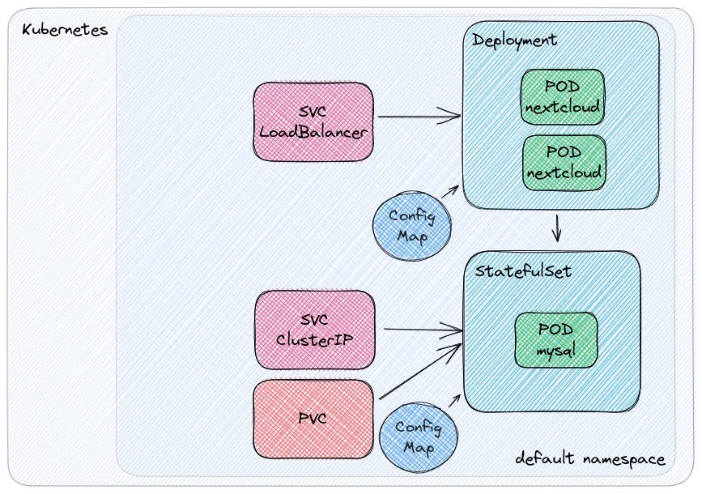

# cdk8s for nextcloud

<!--  -->

<p align="center">
    
</p>

## How to setup project on your local
[cdk8s.io docs](https://cdk8s.io/)
```bash
npm install -g cdk8s-cli
pipenv install --dev
pipenv shell
```


## Useful commands:
#### To produce and inspect the generated manifest, you can run: 
```bash
cdk8s synth
```

#### Apply to any Kubernetes cluster using standard tools like:
```bash
kubectl apply -f dist/cdk8s-nextcloud.k8s.yaml
```

#### For troubleshooting:
```bash
kubectl port-forward my-pod 8080:80
kubectl exec -it my-pod bash
```
